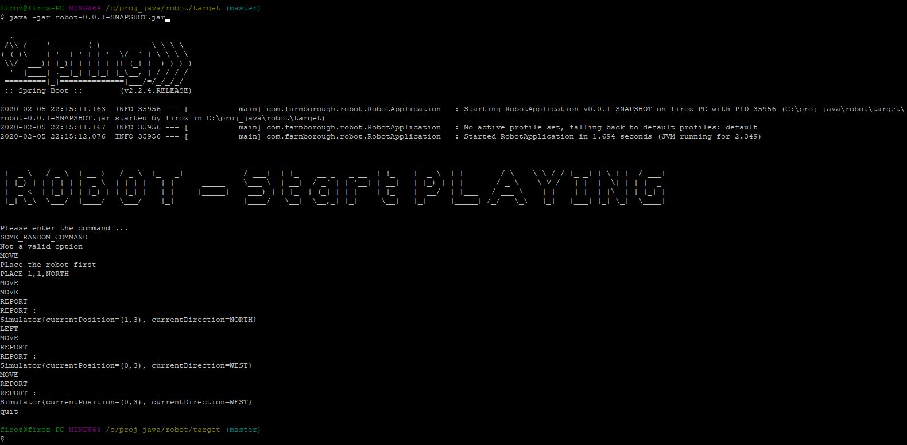

checkout the project from following git repository

<h1>    git@github.com:firoz365/robot.git </h1>

Then go to target folder and run the following command -
#    java -jar robot-0.0.1-SNAPSHOT.jar #

To quit  - type quit , exit or !q

Then you can enter commands like following  -

SOME_RANDOM_COMMAND  
Not a valid option  
MOVE  
Place the robot first  
PLACE 1,1,NORTH  
MOVE  
MOVE  
REPORT  
REPORT :  
Simulator{currentPosition=(1,3), currentDirection=NORTH}   
LEFT  
MOVE  
REPORT  
REPORT :  
Simulator{currentPosition=(0,3), currentDirection=WEST}  
MOVE  
REPORT  
REPORT :  
Simulator{currentPosition=(0,3), currentDirection=WEST}  
quit  

<h1>Here is the screenshot -</h1>

